# Rahat Zaman - [rahatzamancse.netlify.app](https://rahatzamancse.netlify.app) 

## TL;DR
- 🔭 I’m currently a **[Graduate Research Assistant and PhD student at University of Utah](https://www.sci.utah.edu/people/rahatzamancse.html)**.
- 🌱 I’m currently learning **Advanced Data Visualization in Deep Learning model Development**.
- 👯 I’m looking to collaborate on **Data Visualization with Machine Learning**.
- 💬 Ask me about anything by mail **[rahatzamancse@gmail.com](mailto:rahatzamancse@gmail.com)**.
- 🤣 Fun fact: I once wanted to be a game developer.

<strong>Click here and Peek on the latest 5 blog posts</strong>

💁🏻 <a href="https://rahatzamancse.netlify.app">rahatzamancse.netlify.app</a>

<!-- BLOG-POST-LIST:START -->
- [You Can Make Anything With Rofi](https://rahatzamancse.netlify.app/en/posts/you-can-make-anything-with-rofi/)
- [A Trivial Visualization with Plotly Express](https://rahatzamancse.netlify.app/en/posts/a-trivial-visualization-with-plotly/)
- [Some Notes About SXHKD](https://rahatzamancse.netlify.app/en/posts/some-notes-about-sxhkd/)
- [My Polybar Tips and Tricks](https://rahatzamancse.netlify.app/en/posts/my-polybar-tips-and-tricks/)
- [Switching from VIM to NeoVIM](https://rahatzamancse.netlify.app/en/posts/switching-to-nvim/)
<!-- BLOG-POST-LIST:END -->

---

 
<strong>🇺🇸Hi | 🇧🇩শুভ দিবা | 🇯🇵こんにちは</strong>

I am Rahat Zaman. I am a Researcher in Data Visualization and Deep Learning.

### Facts about me

- Favorite Operating System: [CachyOS](https://cachyos.org/)
- Favorite Text Editor: [neoVIM](https://neovim.io/)
- Favorite Programming Language: [Rust](https://www.rust-lang.org/) for optimization, [Python](https://www.python.org/) for playing with data and EDA, [Typescript](https://www.typescriptlang.org/) for web development
- Favorite Desktop Environment: [Gnome](https://www.gnome.org/)

---

## Skills
| Languages  | Frameworks |
| ---------- | ---------- |
|           |                |

---

## GitHub stats
<!--Graph-->

<!--  -->
<!--  -->

<!--Skill And More Information--> 

  
   
  

 

 <!--Total Contributions--> 
 

   <!--Skills Graph-->

```mermaid
graph TD;
    Data_Scientist[Data_Scientist]-->Languages;
    Data_Scientist-->ML_DL;
    Data_Scientist-->Python_Ecosystem;
    Data_Scientist-->Data_Viz;
    Data_Scientist-->Frontend;
    Data_Scientist-->Backend;
    Data_Scientist-->Big_Data;
    Data_Scientist-->DevOps_Tools;

    %% Languages
    Languages-->Python;
    Languages-->R;
    Languages-->Rust;
    Languages-->C++;
    Languages-->Java;
    Languages-->TypeScript;
    Languages-->JavaScript;
    Languages-->SQL;
    Languages-->Bash;
    Languages-->HTML;
    Languages-->CSS;

    %% ML / DL and related domains
    ML_DL-->Machine_Learning;
    ML_DL-->Deep_Learning;
    ML_DL-->PyTorch;
    ML_DL-->TensorFlow;
    ML_DL-->Keras;
    ML_DL-->scikit_learn;
    ML_DL-->OpenCV;
    ML_DL-->NLP;
    ML_DL-->Computer_Vision;
    ML_DL-->spaCy;
    ML_DL-->NLTK;
    ML_DL-->Transformers;

    %% Python ecosystem libs and tools
    Python_Ecosystem-->NumPy;
    Python_Ecosystem-->Pandas;
    Python_Ecosystem-->SciPy;
    Python_Ecosystem-->Jupyter_Notebook;

    %% Data Visualization
    Data_Viz-->Plotly;
    Data_Viz-->Matplotlib;
    Data_Viz-->Seaborn;
    Data_Viz-->D3_js;
    Data_Viz-->Streamlit;
    Data_Viz-->Altair;

    %% Frontend
    Frontend-->React;
    Frontend-->Svelte;
    Frontend-->TypeScript;
    Frontend-->JavaScript;
    Frontend-->Bootstrap;
    Frontend-->JQuery;

    %% Backend / Web
    Backend-->Flask;
    Backend-->Django;
    Backend-->FastAPI;

    %% Big Data
    Big_Data-->Spark;

    %% DevOps and Tools
    DevOps_Tools-->Git;
    DevOps_Tools-->Docker;
    DevOps_Tools-->Linux;
    DevOps_Tools-->GitHub_Actions;
```

## Want to play chess right in my GitHub? 🔥♟👑♟🔥

Here is the current state board! **Give your move in [my github repository](https://github.com/rahatzamancse/github-chess)!**

